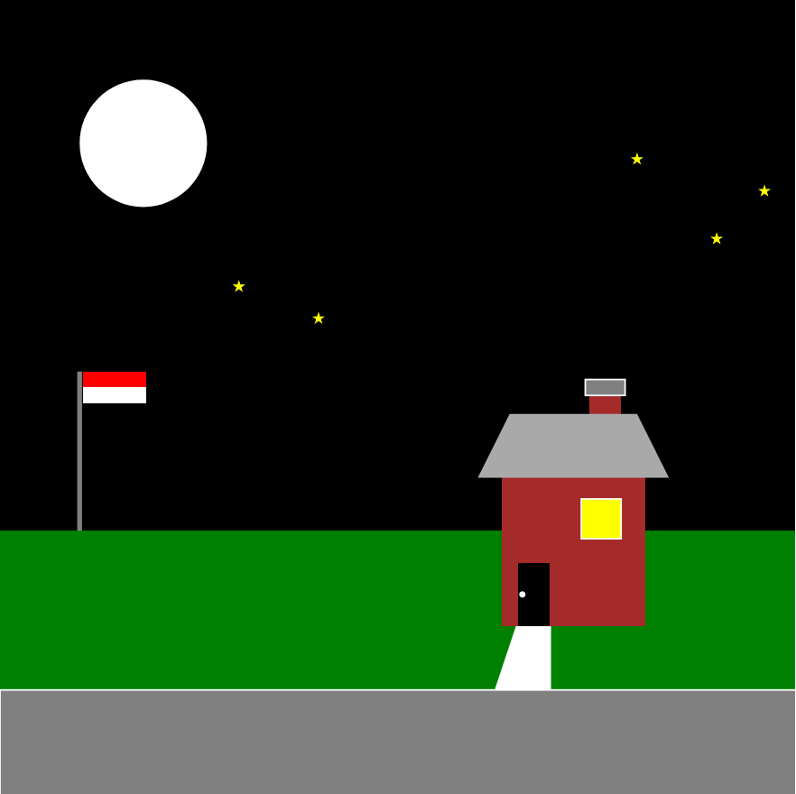

Assignment 1 - Hello World: GitHub and d3  
===
Name: Aviv Nur

Link to the page: [Assignment 1](https://avivnur.github.io/a1-ghd3/)
# Documentation for D3.js Visualization

This JavaScript code uses the D3.js library to create a dynamic SVG visualization of a day to night transition in a simple landscape scene.

This line selects the body of the HTML document to append the SVG to.

```
let height = 500;
let width = 500;
```

These lines set the height and width of the SVG.
```
let svg = canvas.append('svg')
                .attr('height', height)
                .attr('width', width)
                .attr('style', 'background-color: lightblue');
```
This block creates the SVG and sets its height, width, and background color.

The following blocks of code create various elements in the scene, such as the sky, moon, sun, stars, grass, road lines, house, chimney, roof, door, window, door knob, road, flag pole, and the Indonesian flag. Each element is appended to the SVG and its attributes such as position, size, and color are set. Some elements also have transitions to simulate the day to night transition.

For example, the block of code for the sky is as follows:
```
// The sky night
svg.append("rect").attr("x", 0)
                    .attr("y", 0)
                    .attr("width", width)
                    .attr("height", height - height/3)
                    .attr("fill", "lightblue")
                    .transition()
                    .duration(10000)
                    .attr("fill", "black");
```

This block creates a rectangle for the sky, sets its position, size, and initial color, and then transitions the color from light blue (day) to black (night) over a duration of 10,000 milliseconds.

Example of transformation:

From:


To:


# References:

1. [Introduction to D3.js - Coursera Project Network](https://www.coursera.org/programs/tech-ready-louisiana-oewez/projects/introduction-to-d3-js)

2. [D3.js symbolStar symbol](https://www.geeksforgeeks.org/d3-js-symbolstar-symbol/)

3. [d3-shape](https://d3js.org/d3-shape)

4. [d3-transition](https://d3js.org/d3-transition)